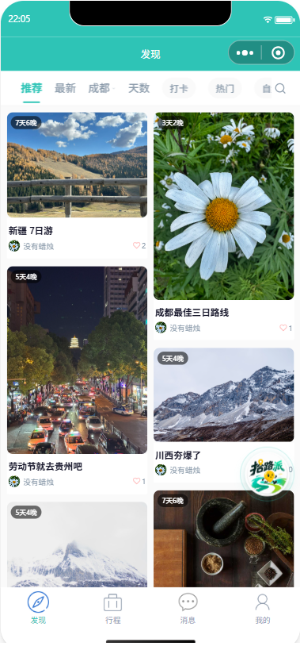

# 拾路派（AI Travel）

拾路派是一套面向微信生态的 AI 智能旅行产品，覆盖“灵感发现 → AI 规划 → 地图路线 → 行程执行 → 内容分享 → 后台运营”的完整链路。项目采用前后端分离与多服务架构，包含微信原生小程序、旅行服务、管理服务、React 管理后台和 MySQL 数据脚本。

## 扫码体验

使用微信扫描下方小程序码，即可进入拾路派小程序：


> 如无法正常打开，请确认当前微信账号已具备小程序访问权限。

## 使用演示

[点击观看拾路派小程序使用视频](docs/assets/usage-demo.mp4)

视频展示了小程序的主要页面与核心使用流程，可直接在 GitHub 中打开或下载观看。

## 产品界面



## 核心能力

- **AI 行程规划**：根据目的地、日期、预算、偏好和必去景点生成结构化多日行程，并支持对话式调整与确认。
- **地图与导航**：提供地理编码、POI 搜索、天气、酒店检索、多点路线规划和导航中转。
- **行程管理**：创建、保存、编辑、删除和查看行程，支持每日景点、打卡、当前行程和旅行清单。
- **户外路线**：提供徒步路线、分段数据、安全信息、装备建议及路线发布能力。
- **旅行社区**：支持游记发布、评论、回复、点赞、收藏、关注和个人主页。
- **消息与会话**：包含系统消息、未读统计、即时消息会话和 AI 对话历史。
- **用户成长**：签到、积分记录、等级配置、积分获取/消费和模板解锁。
- **运营后台**：覆盖用户、行程、内容、积分、公告、敏感词、管理员和操作日志管理。

## 系统架构

```text
微信小程序 miniprogram
        │ /api/v1/*
        ▼
travel-service :8080 ─────┐
                          ├── MySQL: travel_app
admin-service  :8081 ─────┘
        ▲
        │ /api/v1/admin/*
React 管理后台 admin-frontend :3000 / :80

外部能力：DeepSeek、腾讯地图、Pixabay、微信登录/云托管
```

## 技术栈

| 层级 | 技术 |
| --- | --- |
| 微信端 | 微信原生小程序（WXML / WXSS / JavaScript）、微信云托管 |
| 管理端 | React 18、TypeScript、Vite 5、Ant Design 5、Axios、React Router 6 |
| 后端 | Java 17、Spring Boot 3.2.4、MyBatis-Plus 3.5.5、JWT、Flyway |
| 数据库 | MySQL 8，SQL 初始化与增量迁移 |
| 外部服务 | DeepSeek、腾讯地图、Pixabay、微信开放能力 |
| 部署 | Docker 多阶段构建、Nginx、微信云托管 |

## 目录说明

```text
AI-Travel/
├── miniprogram/          # 微信原生小程序，页面、组件、API 和工具库
├── ai-travel-backend/    # 推荐使用的 Maven 多模块后端
│   ├── common/           # 通用响应、异常、数据模型等共享代码
│   ├── travel-service/   # 小程序业务服务，默认端口 8080
│   └── admin-service/    # 管理后台服务，默认端口 8081
├── admin-frontend/       # React + Vite 管理后台
├── sql/                  # 全量初始化、种子数据和增量迁移脚本
├── design-audit/         # 设计审查截图
└── 部署指南.md            # 微信云托管部署说明
```

后端统一以 `ai-travel-backend` 为唯一开发主线，用户端和管理端通过 `common` 模块共享公共能力。

## 小程序页面

小程序目前包含发现首页、AI 规划、地图、我的行程、行程详情、当前行程、酒店、徒步路线、旅行清单、足迹、发布与编辑、收藏、关注、消息、即时聊天、AI 聊天、积分、个人资料和设置等页面。公共请求层会把 `/api/*` 自动转换为多模块后端使用的 `/api/v1/*`。

主要复用组件包括：

- `waypoint-timeline`：途经点时间线
- `path-picker`：路线/路径选择
- `route-stats-card`：路线统计卡片
- `chat-fab`：全局 AI 聊天入口

## 后端服务

### travel-service（8080）

主要 API 分组：

- `/api/v1/auth`：微信登录、游客登录、密码重置
- `/api/v1/trips`：AI 生成、行程增删改查、行程状态与景点
- `/api/v1/chat`：AI 消息、确认、会话列表和历史
- `/api/v1/map`：地理编码、POI、路线、酒店和天气
- `/api/v1/cities`：城市列表、热门城市、分组与坐标
- `/api/v1/hiking`：徒步路线、分段、安全和装备
- `/api/v1/social`：发布、评论、点赞、收藏和关注
- `/api/v1/messages`、`/api/v1/im`：系统消息与即时通信
- `/api/v1/points`：积分、签到、等级和模板解锁
- `/api/health`：健康检查

### admin-service（8081）

管理接口统一位于 `/api/v1/admin/*`，包括登录、仪表盘、用户、行程、内容审核、积分、管理员、公告、敏感词和操作日志。

## 数据模型

`sql/full-init.sql` 可初始化完整数据库。主要表包括：

- 用户与行程：`users`、`trip_plans`、`trip_days`、`trip_spots`
- 内容社区：`trip_publish`、`comment`、`like_record`、`follow_relation`
- 消息与地点：`message`、`attractions`、`hotels`、`city`
- 徒步：`hiking_route`、`hiking_segment`
- 积分：`user_points`、`point_record`、`sign_in_record`、`level_config`
- 后台：`admin_users`、`admin_logs`、`sensitive_words`、`system_announcements`

## 本地启动

### 1. 环境要求

- JDK 17+
- Maven 3.9+
- Node.js 20+
- MySQL 8+
- 微信开发者工具

### 2. 初始化数据库

```bash
mysql -u root -p < sql/full-init.sql
```

默认数据库名为 `travel_app`。已有数据库可按时间顺序执行 `sql/migrations/` 中的脚本。

### 3. 配置后端

敏感配置不会提交到 Git。首次运行时复制安全模板：

```powershell
Copy-Item ai-travel-backend/travel-service/src/main/resources/application.example.yml ai-travel-backend/travel-service/src/main/resources/application.yml
Copy-Item ai-travel-backend/admin-service/src/main/resources/application.example.yml ai-travel-backend/admin-service/src/main/resources/application.yml
```

建议通过环境变量提供以下配置：

```text
DB_URL, DB_USERNAME, DB_PASSWORD
DEEPSEEK_API_KEY
TMAP_KEY
PIXABAY_API_KEY
WECHAT_APP_ID, WECHAT_APP_SECRET
JWT_SECRET, ADMIN_JWT_SECRET
```

生产环境必须替换两个 JWT 默认值，并为用户端与管理端使用不同密钥。

### 4. 启动后端

```bash
cd ai-travel-backend
mvn clean install -DskipTests
mvn -pl travel-service -am spring-boot:run
```

另开终端启动管理服务：

```bash
cd ai-travel-backend
mvn -pl admin-service -am spring-boot:run
```

验证地址：

- 旅行服务：`http://localhost:8080/api/health`
- 管理服务：`http://localhost:8081`

### 5. 启动管理后台

```bash
cd admin-frontend
npm ci
npm run dev
```

访问 `http://localhost:3000/admin`。Vite 会把管理 API 请求代理到 `http://localhost:8081`。

### 6. 启动微信小程序

1. 用微信开发者工具导入 `miniprogram/`。
2. 在 `miniprogram/config/constants.js` 中把 `DEBUG_MODE` 设为 `true` 进行本地联调。
3. 填写自己的微信小程序 AppID，并确认本地后端已监听 `8080`。
4. 编译并在模拟器或真机中测试。

## Docker 构建

在 `ai-travel-backend` 目录执行：

```bash
# 旅行服务
docker build --build-arg BUILD_SERVICE=travel-service -t shilupai-travel-service .

# 管理服务
docker build --build-arg BUILD_SERVICE=admin-service -t shilupai-admin-service .
```

管理后台：

```bash
docker build -t shilupai-admin-frontend ./admin-frontend
```

更完整的微信云托管说明见 [部署指南](部署指南.md)。

## 安全说明

- 仓库已忽略本地 `application*.yml`、构建产物、依赖目录和 IDE 文件。
- 不要把数据库密码、微信 AppSecret、AI Key、地图 Key 或 JWT 密钥提交到版本库。
- 若任何密钥曾公开出现，请先在对应平台轮换，再进行生产部署。
- 生产环境建议启用 HTTPS、限制数据库公网访问、关闭 Swagger，并使用云端密钥管理服务。

## 相关文档

- [部署指南](部署指南.md)
- [小程序 PRD](miniprogram/PRD.md)
- [小程序设计 QA](miniprogram/design-qa.md)
- [用户研究计划](用户研究计划.md)
- [改进机会优先级](改进机会优先级图.md)

## License

本项目使用 Apache License 2.0，详见 `LICENSE`。
